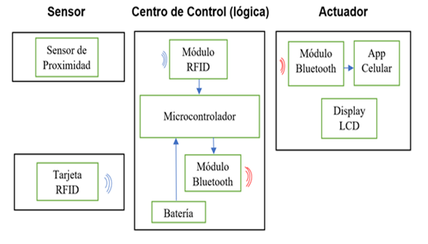
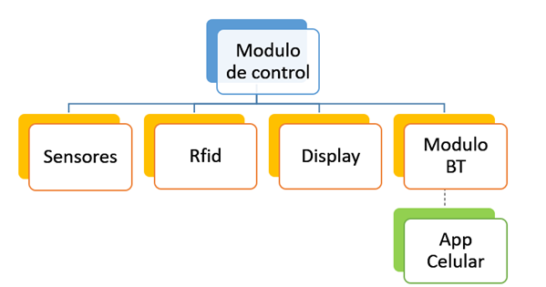

# Sistema de Acceso para Estacionamientos (SAE)

Este proyecto consiste en un sistema integral de automatización para el control de ingreso y egreso de vehículos. El objetivo principal es optimizar el flujo vehicular y restringir el acceso a personal no autorizado mediante tecnología **RFID** y monitoreo remoto vía **Bluetooth**.

## 🚀 Características Principales
* **Control de Acceso mediante RFID:** Validación de usuarios autorizados mediante tarjetas MIFARE.
* **Gestión de Disponibilidad en Tiempo Real:** Seguimiento automático de cupos (máximo 8 vehículos) con visualización en display LCD e interfaz móvil.
* **Automatización de Barreras:** Control preciso de servomotores para apertura y cierre tras la detección completa del vehículo mediante sensores ultrasónicos.
* **Monitoreo Remoto (Android):** Interfaz para el personal de seguridad que permite la visualización de estado y el control manual de emergencia de las barreras.

## 🛠️ Stack Tecnológico
### Hardware
* **Microcontrolador:** STM32F411 Discovery Kit (Cortex-M4).
* **Sensores:** 3x HC-SR04 (Ultrasonido) y 1x RC522 (Lector RFID).
* **Actuadores:** 2x Servomotores SG90 y Display LCD 16x2 con interfaz I2C.
* **Comunicación:** Módulo Bluetooth HC-05.

### Software
* **Firmware:** Desarrollado en **C** utilizando **STM32CubeIDE** y librerías **HAL**.
* **App Móvil:** Diseñada con **MIT App Inventor** para dispositivos Android.
* **Diseño de PCB:** Esquemático y ruteado realizado en **KiCad**.

## 📐 Arquitectura de Bajo Nivel y Protocolos
El sistema pone en funcionamiento múltiples periféricos y protocolos de comunicación del microcontrolador:
* **SPI:** Comunicación con el lector RFID RC522.
* **I2C:** Control del display LCD mediante solo 2 pines (SDA/SCL).
* **UART:** Comunicación serie con el módulo Bluetooth y envío de alertas al smartphone.
* **PWM:** Control de posición de los servomotores para las barreras ($0^{\circ}$ a $90^{\circ}$).
* **Timers:** Configurados para la captura de señales de los sensores ultrasónicos y sincronización de datos.

## 📂 Estructura del Proyecto
* **[/firmware](./firmware):** Contiene el código fuente en C desarrollado para la STM32F411, incluyendo las rutinas de control y librerías HAL.
* **[/docs](./docs):** Documentación técnica completa, hojas de datos (datasheets) de los componentes, el informe final del proyecto y el manual de uso de la aplicación.
* **[/media](./media):** Registro fotográfico de la maqueta y demostraciones en video del sistema de acceso funcionando en tiempo real.
* **[/bin](./bin):** Archivo ejecutable (.apk) de la aplicación móvil diseñada para el monitoreo y control remoto del estacionamiento.